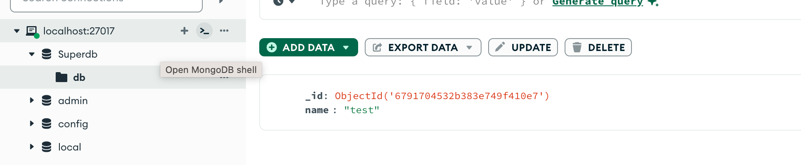
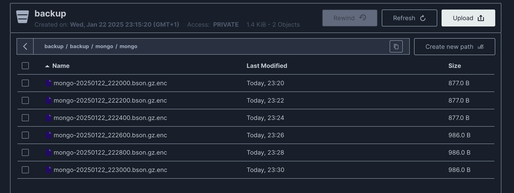
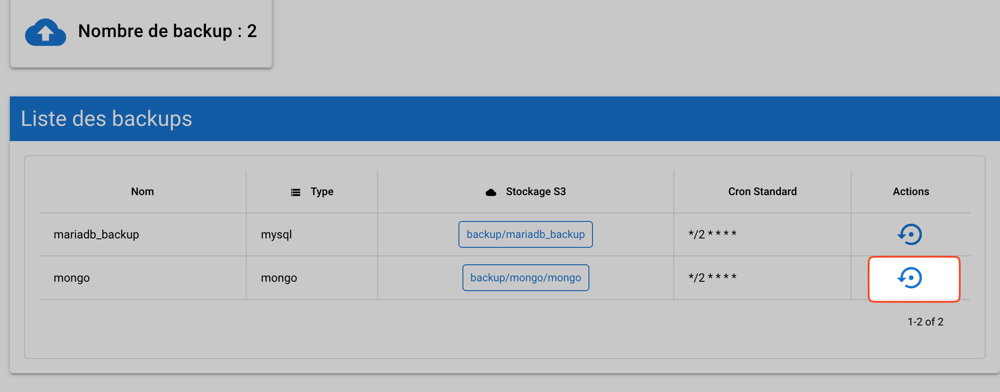
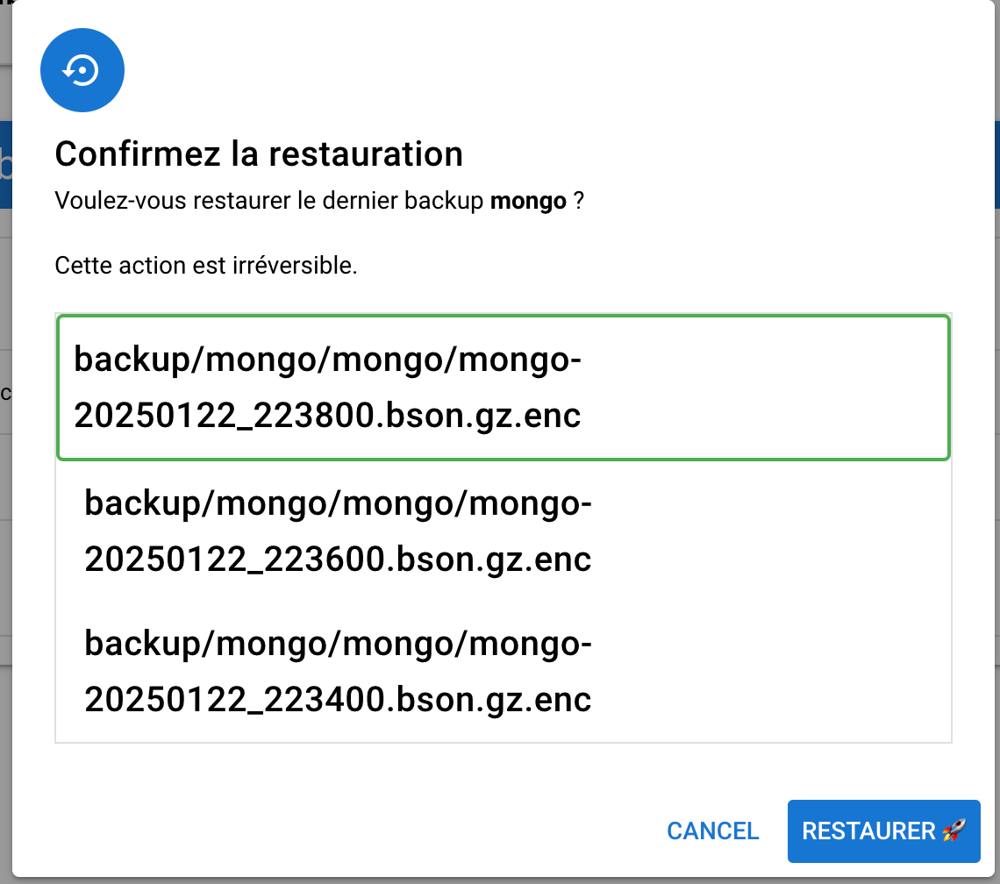

import { Aside, LinkCard, CardGrid, FileTree } from '@astrojs/starlight/components';

Pour faciliter la compréhension de l'outil, nous avons décidé d'utiliser docker pour vous proposes une configuration simple et fonctionnelle.

## Installation

En prérequis il faudra donc docker et docker-compose.

En premier nous allons télécharger le projet mini-backup-getting-started.

**Wget :**
```bash
wget https://github.com/aidalinfo/mini-backup-getting-started/archive/refs/heads/main.zip \
     -O mini-backup-getting-started.zip
```

**Curl :**
```bash
curl -L https://github.com/aidalinfo/mini-backup-getting-started/archive/refs/heads/main.zip \
     -o mini-backup-getting-started.zip
```

Ensuite, nous allons décompresser le fichier téléchargé.

```bash
unzip mini-backup-getting-started.zip
cd mini-backup-getting-started-main
```

## Explication docker compose

En premier nous avons un conteneur minio qui va nous permettre de créer un bucket pour les sauvegardes.
Nous avons aussi un conteneur pour la création du bucket.

```yaml
    image: minio/minio
    container_name: minio
    restart: always
    ports:
      - "9000:9000"
      - "9001:9001"
    environment:
      MINIO_ROOT_USER: minioadmin
      MINIO_ROOT_PASSWORD: miniopassword
    volumes:
      - ./minio/data:/data
    command: server /data --console-address ":9001"
    
  createbuckets:
    image: minio/mc
    depends_on:
      - minio
    entrypoint: >
      /bin/sh -c "
      /usr/bin/mc config host add minio http://minio:9000 minioadmin miniopassword;
      /usr/bin/mc rm -r --force minio/backup;
      /usr/bin/mc mb minio/backup;
      /usr/bin/mc policy download minio/backup;
      exit 0;
```

Ensuite le conteneur mini-backup, qui va contenir la CLI, le serveur et l'API.
AUTO_CONFIG va nous permettre de généré automatiquement les fichier de configuration requis.

AES KEY est la clé AES utilisée pour chiffrer les sauvegardes, vous pouvez en générer une avec la commande ```openssl rand -base64 32```

```yaml
  mini-backup:
    image: rg.fr-par.scw.cloud/open-mini-backup/mini-backup:latest
    container_name: mini-backup
    restart: always
    volumes:
      - ./config:/app/config
    environment:
      - AUTO_CONFIG=true
      - MINIO_ACCESS_KEY=minioadmin
      - MINIO_SECRET_KEY=miniopassword
      - GO_ENV=dev
      - AES_KEY=582e9ffb85124ee9b8cd572927ef671648e9dedd36f5352f755750930a2248d6
```

Pour la partie frontend et communication nous avons le conteneur de frontend et nginx.

```yaml
  ui-mini-backup:
    image: rg.fr-par.scw.cloud/open-mini-backup/ui-mini-backup:latest
    container_name: ui-mini-backup
    restart: always

  nginx:
    image: nginx:latest
    container_name: nginx
    restart: always
    ports:
      - "80:80"
    volumes:
      - ./nginx.conf:/etc/nginx/nginx.conf:ro
    depends_on:
      - mini-backup
      - ui-mini-backup
```
<Aside type="caution" title="Communication">
    Aucune variable d'environment peut être définie pour le conteneur frontend.
    nginx nous sert à exposer l'api de mini-backup sur localhost/api afin que le frontend puisse communiquer avec.
</Aside>

Enfin, pour réaliser nos tests, nous avons un conteneur mariadb et un conteneur mongo.

```yaml

  mariadb:
    image: mariadb
    container_name: mariadb
    restart: always
    volumes:
      - ./mariadb/data:/var/lib/mysql
    # ports:
    #   - "3306:3306"
    environment:
      - MARIADB_ROOT_PASSWORD=password
      - MARIADB_DATABASE=superdb
      - MARIADB_USER=user
      - MARIADB_PASSWORD=admin

  mongo:
    image: mongo
    restart: always
    container_name: mongo
    # ports:
      # - 27017:27017
    environment:
      MONGO_INITDB_ROOT_USERNAME: root
      MONGO_INITDB_ROOT_PASSWORD: example
```

Maintenant nous allons faire un ```docker compose up``` pour lancer les conteneurs et générer les fichiers de configuration.

```bash
docker compose up -d
```

Deux fichier vont apparaître dans le dossier config

```bash
➜  mini-backup-getting-started-main ls config
config.yaml server.yaml
```

Le fichier config.yaml va contenir la configuration de nos backups, les identifiants de connexion à nos bases de données, chemin de sauvegarde, politique de rétention et cron.

Ici, nous allons éditer le fichier server.yaml pour indiquer le nom du bucket S3 et les identifiants de connexion pour héberger nos sauvegardes.

Voici notre section rstorage après modification :

```yaml
rstorage:
  minio:
    endpoint: "http://minio:9000"
    bucket_name: "backup"
    access_key: "${{MINIO_ACCESS_KEY}}"
    secret_key: "${{MINIO_SECRET_KEY}}"
    region: "fr-par"
```

Nous allons aussi décommenter la partie port de mongo, afin d'y accéder avec mongo compass et y insérer des données.

<Aside>Vous pouvez aussi demander à GPT un script pour mysql ou autre, l'objectif est de voir comment restaurer nos données.</Aside>

```yaml
    ports:
      - 27017:27017
```
## Vérification

Une fois la modification effectuée, nous allons relancer le docker compose.

```bash
docker compose up -d && docker compose restart
```

Pour s'assurer que tout ce passe bien nous pouvons vérifier les logs du conteneur.

```bash
docker logs mini-backup
```

Résultat :

```
🚀 DEV CONSOLE 🚀 -- Successfully compressed backups/mongo-20250122_222200.bson.gz
🚀 DEV CONSOLE 🚀 -- [CORE_UTILS] Loading config file: config/server.yaml
🚀 DEV CONSOLE 🚀 -- La section [minio] existe déjà dans le fichier credentials. Aucune modification nécessaire.
🚀 DEV CONSOLE 🚀 -- S3Manager initialized
🚀 DEV CONSOLE 🚀 -- Fichier backups/mongo-20250122_222200.bson.gz.enc téléversé avec succès vers backup/mongo/mongo/mongo-20250122_222200.bson.gz.enc
🚀 DEV CONSOLE 🚀 -- Successfully uploaded backups/mongo-20250122_222200.bson.gz.enc to backup
[backups/mongo-20250122_222200.bson.gz]
🚀 DEV CONSOLE 🚀 -- Successfully backed up MongoDB for mongo: backups/mongo-20250122_222200.bson.gz
```

Maintenant nous allons créer une base et un document dans mongo.



Nous voyons que sur l'interface de minio, depuis la création du document, la taille du backup est un peu plus grande.



<Aside>L'interface de minio est accessible à l'adresse http://localhost:9001</Aside>

**(Nous avons donc supprimer notre base de données pour tester la restauration)**

## Restauration

Pour restaurer nos données, nous avons par l'interface web ou la cli de mini-backup.

### Web

Rendez-vous sur http://localhost pour accéder à l'interface de mini-backup.

Sur la page d'accueil, nous avons notre liste des backups et nous pouvons cliquer sur l'icône de restauration afin d'initier la procédure.



Nous avons un encadré du backup qui sera restauré, nous pouvons cliquer sur le bouton de restauration pour récupérer notre base précédemment supprimée.

