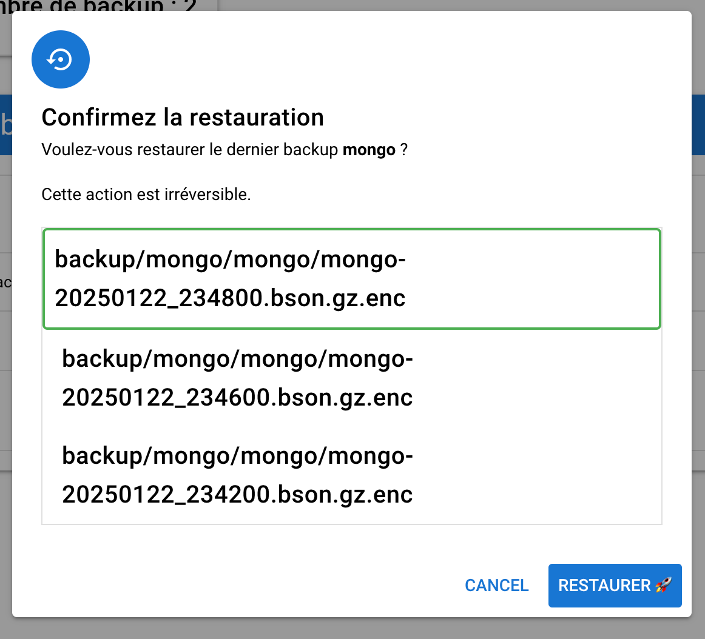
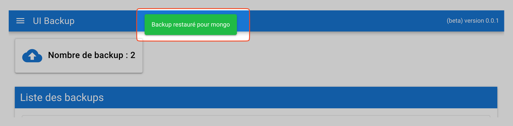

import { Aside, LinkCard, CardGrid, FileTree } from '@astrojs/starlight/components';

Pour simplifier l’utilisation de Mini Backup, nous avons conçu une configuration basée sur **Docker** et **Docker Compose**. Ce guide vous accompagnera pas à pas pour installer et configurer l’outil rapidement.


## Prérequis

Assurez-vous d’avoir installé :
- **Docker**
- **Docker Compose**

Si ce n’est pas déjà fait, vous pouvez consulter la documentation officielle de Docker pour les instructions d’installation.

## Installation

En prérequis il faudra donc docker et docker-compose.

En premier nous allons télécharger le projet mini-backup-getting-started.

**Wget :**
```bash
wget https://github.com/aidalinfo/mini-backup-getting-started/archive/refs/heads/main.zip \
     -O mini-backup-getting-started.zip
```

**Curl :**
```bash
curl -L https://github.com/aidalinfo/mini-backup-getting-started/archive/refs/heads/main.zip \
     -o mini-backup-getting-started.zip
```

Ensuite, nous allons décompresser le fichier téléchargé.

```bash
unzip mini-backup-getting-started.zip
cd mini-backup-getting-started-main
```

## Explication docker compose

Voici un aperçu des principaux conteneurs définis dans le fichier docker-compose.yml.

### minio

Le conteneur Minio simule un serveur S3 pour héberger vos sauvegardes. Un deuxième conteneur crée automatiquement un bucket nommé backup.

```yaml
    image: minio/minio
    container_name: minio
    restart: always
    ports:
      - "9000:9000"
      - "9001:9001"
    environment:
      MINIO_ROOT_USER: minioadmin
      MINIO_ROOT_PASSWORD: miniopassword
    volumes:
      - ./minio/data:/data
    command: server /data --console-address ":9001"
    
  createbuckets:
    image: minio/mc
    depends_on:
      - minio
    entrypoint: >
      /bin/sh -c "
      /usr/bin/mc config host add minio http://minio:9000 minioadmin miniopassword;
      /usr/bin/mc rm -r --force minio/backup;
      /usr/bin/mc mb minio/backup;
      /usr/bin/mc policy download minio/backup;
      exit 0;
```
### mini-backup

Ce conteneur inclut la CLI, le serveur et l’API. L’environnement AUTO_CONFIG génère automatiquement les fichiers de configuration.

AES KEY est la clé AES utilisée pour chiffrer les sauvegardes, vous pouvez en générer une avec la commande ```openssl rand -base64 32```

```yaml
  mini-backup:
    image: rg.fr-par.scw.cloud/open-mini-backup/mini-backup:latest
    container_name: mini-backup
    restart: always
    volumes:
      - ./config:/app/config
    environment:
      - AUTO_CONFIG=true
      - MINIO_ACCESS_KEY=minioadmin
      - MINIO_SECRET_KEY=miniopassword
      - GO_ENV=dev
      - AES_KEY=582e9ffb85124ee9b8cd572927ef671648e9dedd36f5352f755750930a2248d6
```

### frontend et nginx

L’interface web et le serveur API communiquent via Nginx.

```yaml
  ui-mini-backup:
    image: rg.fr-par.scw.cloud/open-mini-backup/ui-mini-backup:latest
    container_name: ui-mini-backup
    restart: always

  nginx:
    image: nginx:latest
    container_name: nginx
    restart: always
    ports:
      - "80:80"
    volumes:
      - ./nginx.conf:/etc/nginx/nginx.conf:ro
    depends_on:
      - mini-backup
      - ui-mini-backup
```
<Aside type="caution" title="Communication">
    Aucune variable d'environment peut être définie pour le conteneur frontend.
    Nginx expose l’API de Mini Backup sur `localhost/api` pour permettre la communication.
</Aside>

### MariaDB et MongoDB

Des conteneurs MariaDB et MongoDB sont également définis pour réaliser des tests avec Mini Backup.

```yaml

  mariadb:
    image: mariadb
    container_name: mariadb
    restart: always
    volumes:
      - ./mariadb/data:/var/lib/mysql
    # ports:
    #   - "3306:3306"
    environment:
      - MARIADB_ROOT_PASSWORD=password
      - MARIADB_DATABASE=superdb
      - MARIADB_USER=user
      - MARIADB_PASSWORD=admin

  mongo:
    image: mongo
    restart: always
    container_name: mongo
    # ports:
      # - 27017:27017
    environment:
      MONGO_INITDB_ROOT_USERNAME: root
      MONGO_INITDB_ROOT_PASSWORD: example
```

## Lancer les conteneurs

Maintenant nous allons faire un ```docker compose up``` pour lancer les conteneurs et générer les fichiers de configuration.

```bash
docker compose up -d
```

## Configuration

Après le lancement, deux fichiers de configuration seront générés dans le dossier config :

```bash
➜  mini-backup-getting-started-main ls config
config.yaml server.yaml
```

- **config.yaml** : Contient la configuration des backups, y compris les identifiants des bases de données, les chemins de sauvegarde, et les règles de rétention.
- **server.yaml** : Définit les endpoints S3 et les paramètres du serveur.


<LinkCard
    title="En savoir plus"
    href="/docs/configuration/backup"
    description="Configuration détaillée des backups"
/>

Éditez le fichier server.yaml pour indiquer le nom du bucket S3 et les identifiants de connexion pour héberger vos sauvegardes.

Voici notre section rstorage après modification :

```yaml
rstorage:
  minio:
    endpoint: "http://minio:9000"
    bucket_name: "backup"
    access_key: "${{MINIO_ACCESS_KEY}}"
    secret_key: "${{MINIO_SECRET_KEY}}"
    region: "fr-par"
```
<LinkCard
    title="En savoir plus"
    href="/docs/configuration/server"
    description="Configuration détaillée du serveur"
/>

Nous allons aussi exposer le port de mongo, afin d'y accéder avec mongo compass et y insérer des données.

<Aside>Vous pouvez aussi demander à GPT un script pour mysql ou autre, l'objectif est de voir comment restaurer nos données.</Aside>

```yaml
    ports:
      - 27017:27017
```
## Vérification

Une fois les modifications apportées, relancez les conteneurs :

```bash
docker compose up -d && docker compose restart
```

Consultez les journaux pour vérifier que tout fonctionne correctement :

```bash
docker logs mini-backup
```

Résultat :

```
🚀 DEV CONSOLE 🚀 -- Successfully compressed backups/mongo-20250122_222200.bson.gz
🚀 DEV CONSOLE 🚀 -- [CORE_UTILS] Loading config file: config/server.yaml
🚀 DEV CONSOLE 🚀 -- La section [minio] existe déjà dans le fichier credentials. Aucune modification nécessaire.
🚀 DEV CONSOLE 🚀 -- S3Manager initialized
🚀 DEV CONSOLE 🚀 -- Fichier backups/mongo-20250122_222200.bson.gz.enc téléversé avec succès vers backup/mongo/mongo/mongo-20250122_222200.bson.gz.enc
🚀 DEV CONSOLE 🚀 -- Successfully uploaded backups/mongo-20250122_222200.bson.gz.enc to backup
[backups/mongo-20250122_222200.bson.gz]
🚀 DEV CONSOLE 🚀 -- Successfully backed up MongoDB for mongo: backups/mongo-20250122_222200.bson.gz
```

Maintenant nous allons créer une base et un document dans mongo.


Nous voyons que sur l'interface de minio, depuis la création du document, la taille du backup est un peu plus grande.


<Aside>L'interface de minio est accessible à l'adresse http://localhost:9001</Aside>

**(Nous avons donc supprimer notre base de données pour tester la restauration)**

## Restauration

Vous pouvez restaurer vos sauvegardes en utilisant soit l’interface web, soit la ligne de commande.

### Web

Accédez à l’interface de Mini Backup à l’adresse http://localhost/

Sur la page d'accueil, sélectionnez un backup dans la liste et cliquez sur l'icône de restauration.


Un encadré s’affiche pour confirmer la restauration. Cliquez sur le bouton de restauration pour récupérer vos données.




Une fois terminé, vos données seront restaurées avec succès !

### Cli 

**Exécutez la commande suivante pour restaurer la dernière version d’un backup :**

```bash
docker exec mini-backup /app/backup-cli restore mongo last
```

Cette commande spécifie le nom du backup (mongo) et utilise le mot-clé last pour récupérer la version la plus récente.

**Pour restaurer une version antérieure :**

Il suffit de rajouter -it et de retirer last de la dernier commande.

```bash
docker exec -it mini-backup /app/backup-cli restore mongo
```

Cette commande vous demandera de sélectionner une version parmi les backups disponibles.


Sortie complète :

```bash
docker exec -it mini-backup /app/backup-cli restore mongo
Voulez-vous restaurer le dernier backup pour mongo ? (y/n) : n
🚀 DEV CONSOLE 🚀 -- [CORE_UTILS] No config path provided, using default config path
🚀 DEV CONSOLE 🚀 -- [CORE_UTILS] Loading config from config/config.yaml
🚀 DEV CONSOLE 🚀 -- [CORE_UTILS] Loading config file: config/server.yaml
🚀 DEV CONSOLE 🚀 -- La section [minio] existe déjà dans le fichier credentials. Aucune modification nécessaire.
🚀 DEV CONSOLE 🚀 -- S3Manager initialized
Listing des backups disponibles :
🚀 DEV CONSOLE 🚀 -- Liste des backups (préfixe: 'backup/mongo/mongo'): [backup/mongo/mongo/mongo-20250122_232400.bson.gz.enc backup/mongo/mongo/mongo-20250122_232600.bson.gz.enc backup/mongo/mongo/mongo-20250122_232800.bson.gz.enc backup/mongo/mongo/mongo-20250122_233000.bson.gz.enc backup/mongo/mongo/mongo-20250122_233800.bson.gz.enc backup/mongo/mongo/mongo-20250122_234000.bson.gz.enc backup/mongo/mongo/mongo-20250122_234200.bson.gz.enc backup/mongo/mongo/mongo-20250122_234600.bson.gz.enc backup/mongo/mongo/mongo-20250122_234800.bson.gz.enc backup/mongo/mongo/mongo-20250122_235000.bson.gz.enc backup/mongo/mongo/mongo-20250122_235200.bson.gz.enc backup/mongo/mongo/mongo-20250122_235400.bson.gz.enc]
1. backup/mongo/mongo/mongo-20250122_232400.bson.gz.enc
2. backup/mongo/mongo/mongo-20250122_232600.bson.gz.enc
3. backup/mongo/mongo/mongo-20250122_232800.bson.gz.enc
4. backup/mongo/mongo/mongo-20250122_233000.bson.gz.enc
5. backup/mongo/mongo/mongo-20250122_233800.bson.gz.enc
6. backup/mongo/mongo/mongo-20250122_234000.bson.gz.enc
7. backup/mongo/mongo/mongo-20250122_234200.bson.gz.enc
8. backup/mongo/mongo/mongo-20250122_234600.bson.gz.enc
9. backup/mongo/mongo/mongo-20250122_234800.bson.gz.enc
10. backup/mongo/mongo/mongo-20250122_235000.bson.gz.enc
11. backup/mongo/mongo/mongo-20250122_235200.bson.gz.enc
12. backup/mongo/mongo/mongo-20250122_235400.bson.gz.enc
Sélectionnez un numéro de backup : 11
🚀 DEV CONSOLE 🚀 -- Starting restore process for: mongo, version: mongo-20250122_235200.bson.gz.enc
🚀 DEV CONSOLE 🚀 -- [CORE_UTILS] No config path provided, using default config path
🚀 DEV CONSOLE 🚀 -- [CORE_UTILS] Loading config from config/config.yaml
🚀 DEV CONSOLE 🚀 -- Detected MongoDB restore for mongo
🚀 DEV CONSOLE 🚀 -- Starting restore process for: mongo, version: mongo-20250122_235200.bson.gz.enc
🚀 DEV CONSOLE 🚀 -- [CORE_UTILS] Loading config file: config/server.yaml
🚀 DEV CONSOLE 🚀 -- La section [minio] existe déjà dans le fichier credentials. Aucune modification nécessaire.
🚀 DEV CONSOLE 🚀 -- S3Manager initialized
🚀 DEV CONSOLE 🚀 -- Using specified backup version: mongo-20250122_235200.bson.gz.enc
🚀 DEV CONSOLE 🚀 -- Fichier backup/mongo/mongo/mongo-20250122_235200.bson.gz.enc téléchargé avec succès vers backups/mongo-20250122_235200.bson.gz.enc
🚀 DEV CONSOLE 🚀 -- Downloaded encrypted file to: backups/mongo-20250122_235200.bson.gz.enc
🚀 DEV CONSOLE 🚀 -- Decrypted file to: backups/mongo-20250122_235200.bson.gz
🚀 DEV CONSOLE 🚀 -- No decompression needed for: backups/mongo-20250122_235200.bson.gz
Resultat de la restauration: backups/mongo-20250122_235200.bson.gz🚀 DEV CONSOLE 🚀 -- Starting MongoDB restore from: backups/mongo-20250122_235200.bson.gz
🚀 DEV CONSOLE 🚀 -- MongoDB restore completed successfully from: backups/mongo-20250122_235200.bson.gz
Restauration réussie pour mongo (version: mongo-20250122_235200.bson.gz.enc)
```

# Conclusion

Mini Backup est conçu pour vous offrir une solution de sauvegarde simple et efficace, adaptée à vos besoins. Bien que certaines fonctionnalités soient encore en développement, l’outil vous permet déjà de gérer vos backups avec flexibilité et sécurité.

Nous travaillons activement à enrichir Mini Backup avec des tutoriels détaillés et des configurations d’exemple pour chaque type de sauvegarde. Ces améliorations seront bientôt disponibles afin de rendre l’expérience encore plus fluide et complète.

N'hésitez pas à nous faire des retours, et restez à l’écoute pour les prochaines mises à jour !